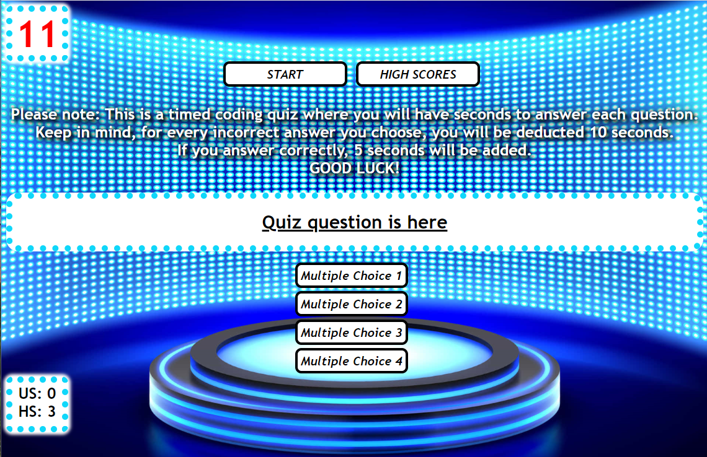

# 04-Web-APIs-Quiz

USER STORY:

This application is a web-based timed quiz on JavaScript fundamentals that stores high scores.

The user will be greeted with a start button and high score button with instructions for the quiz. 

The user will need to click the START button to begin the timed quiz.

Clicking the Start button will hide the Start and High Scores button and quiz instructions, beginnig the quiz.

The timer will then be on display in the top left corner of the screen, with timer ticking audio that will play on a loop throughout the quiz.

The user will have 40 seconds to complete the 5 question quiz.

The user will then be presented with their first question with a list of four multiple answers.

When the user answers a question incorrectly, they will be deducted 10 seconds with an alert notifying them of their incorrect answer, as well as an incorrect buzzer sound.

When the user answers a question correctly, they will be given 5 seconds with an alert notifying them of their correct answer, and a correct buzzer sound.

Quiz ends when all questions are answered, or the timer reaches 0.

The user will then have the opportunity to save their initials and score, that will display on the bottom left of the screen.

APPLICATIONS USED:

    -HTML
    -CSS
    -JavaScript

The following image demonstrates an image of the application's functionality:

LIVE GITHUB LINK: https://wht-rbt.github.io/04-Web-APIs-Quiz/
GITHUB REPOSITORY: https://github.com/WHT-RBT/04-Web-APIs-Quiz/
